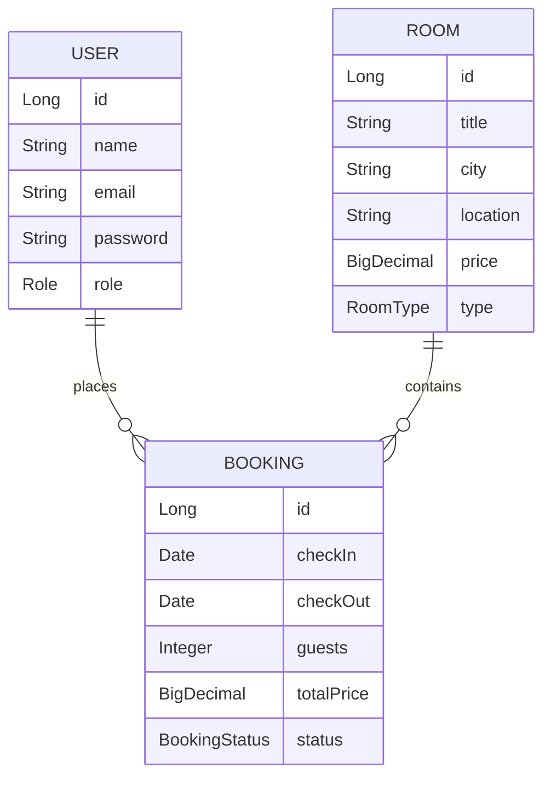
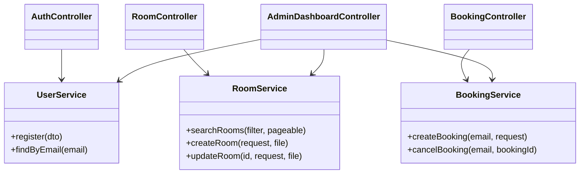

# Hotel Booking System (Spring Boot 3)

Premium hotel booking portal built with Spring Boot 3.x, Java 17, Thymeleaf, JPA, Spring Security (JWT), and MySQL. Users can discover curated rooms, place bookings, and manage their trips, while admins control the inventory via a modern glassmorphism dashboard.

> **Default admin:** `admin3112sand@gmail.com / nextnext`

---

## System Design Snapshot

### ER Diagram



### Class Diagram (high level)



---

## Feature Matrix

- **Public / Marketing**
  - Landing hero with parallax hotel imagery, floating icons, and CTA buttons
  - Responsive rooms catalog with filters (city, type, price range)
- **User Portal**
  - Register, login (JWT cookie), logout
  - View premium room catalogue + details page
  - Book a room (date validation + availability check)
  - My bookings dashboard (status, cancel before check-in)
- **Admin Suite**
  - Analytics dashboard (cards + mini chart)
  - Add / edit / delete rooms with file uploads to `/uploads`
  - View all bookings with totals
  - Instant counts: rooms, bookings, users, revenue

---

## Tech Stack

- **Backend:** Spring Boot 3.5, Java 17, Spring MVC, Spring Data JPA, Validation
- **Security:** Spring Security + JWT (jjwt 0.11.x) using HttpOnly cookies
- **View Layer:** Thymeleaf + Spring Security dialect, custom CSS (glassmorphism, gradients, animations)
- **Database:** H2 in-memory (dev) + MySQL / Render PostgreSQL (prod-ready)
- **Utilities:** Lombok, WebJars Bootstrap (optional), Mockito & JUnit 5 for 14 automated tests

---

## Project Structure

```
src/main/java/com/example/hotel
├── config        # Security, JWT, data seeding, web config
├── controller    # Auth, user, booking, admin, room controllers
├── dto           # BookingRequest, RoomRequest, RoomSearchRequest, UserRegistrationDto
├── entity        # User, Room, Booking, enums (Role, RoomType, BookingStatus)
├── exception     # Global exception handler + custom exceptions
├── repo          # JpaRepository interfaces
├── service       # Interfaces
├── service/impl  # Business logic implementations + storage service
└── ...
```

Static assets live under `src/main/resources/static/{css,js,images}`, while Thymeleaf templates (including fragments) sit under `src/main/resources/templates`.

---

## Getting Started (Local)

1. **Prerequisites**
   - Java 17
   - Maven 3.9+
   - MySQL 8.x (or keep default H2 for dev)

2. **Configure environment (optional)**
   ```bash
   export DB_URL=jdbc:mysql://localhost:3306/hotel_booking?createDatabaseIfNotExist=true&useSSL=false&allowPublicKeyRetrieval=true&serverTimezone=UTC
   export DB_USERNAME=root
   export DB_PASSWORD=secret
   export JWT_SECRET_KEY=Base64Encoded32BytesSecretHere
   ```

3. **Build & Run**
   ```bash
   mvn clean package
   java -jar target/hotel-booking-0.0.1-SNAPSHOT.jar
   ```

4. **Open** `http://localhost:9090`
   - Use seeded admin `admin@example.com / admin123`
   - Register a user to test `/rooms`, `/user/bookings`

Uploads are written to the configurable folder `app.upload-dir` (default `uploads/`). The `FileSystemStorageService` auto-creates the directory and `WebConfig` exposes `/uploads/**` for rendering images.

---

## Automated Testing

- **Scope:** UserService, RoomService, BookingService, RoomController, BookingController, AdminDashboardController
- **Frameworks:** JUnit 5, Mockito, Spring MockMvc
- **Command:** `mvn test`
- **Count:** 14 focused unit + MVC tests (GUVI requirement ≥ 12 satisfied)

---

## Deployment Guide (Render + Managed SQL)

1. **Provision Database**
   - **MySQL (preferred):** ElephantSQL or AWS RDS MySQL. Capture `DB_URL`, `DB_USERNAME`, `DB_PASSWORD`.
   - **Render PostgreSQL alternative:** set `DB_URL=jdbc:postgresql://...` and `DB_DRIVER=org.postgresql.Driver`.

2. **Create Render Web Service**
   - Runtime: **Java 17**
   - Build command: `mvn clean package`
   - Start command: `java -jar target/hotel-booking-0.0.1-SNAPSHOT.jar`

3. **Environment Variables**
   | Key | Description |
   |-----|-------------|
   | `PORT` | Provided by Render; Spring Boot already respects `${PORT:9090}` |
   | `DB_URL` | JDBC string for managed DB |
   | `DB_USERNAME` / `DB_PASSWORD` | DB credentials |
   | `DB_DRIVER` | `com.mysql.cj.jdbc.Driver` or `org.postgresql.Driver` |
   | `JWT_SECRET_KEY` | Base64-encoded ≥ 32 bytes secret |
   | `UPLOAD_DIR` | (Optional) persistent volume mount such as `/var/data/uploads` |

4. **Persistent Storage**
   - Mount a Render disk (e.g., `/var/data/uploads`) and set `UPLOAD_DIR=/var/data/uploads` to retain images.

5. **Health Check**
   - Public endpoints: `/` (redirects to `/rooms`), `/login`, `/register`
   - Admin portal: `/admin/dashboard` (protected)

---

## Screenshots / Proof

- Render deployment snapshot:  
  

Add real screenshots (landing page, admin dashboard, bookings) to `docs/` for richer documentation.

---

## Notes & Tips

- CSRF is disabled because JWT authentication + custom login is used; switch to stateful sessions if desired.
- Update `jwt.secret` / `JWT_SECRET_KEY` with a secure random value before going live.
- Customize theme in `static/css/style.css` or plug in your design system; layout already uses flex/grid for alignment.
- Consider enabling HTTPS and `cookie.setSecure(true)` in `AuthController` when deploying behind TLS.

Enjoy building premium hotel experiences!
